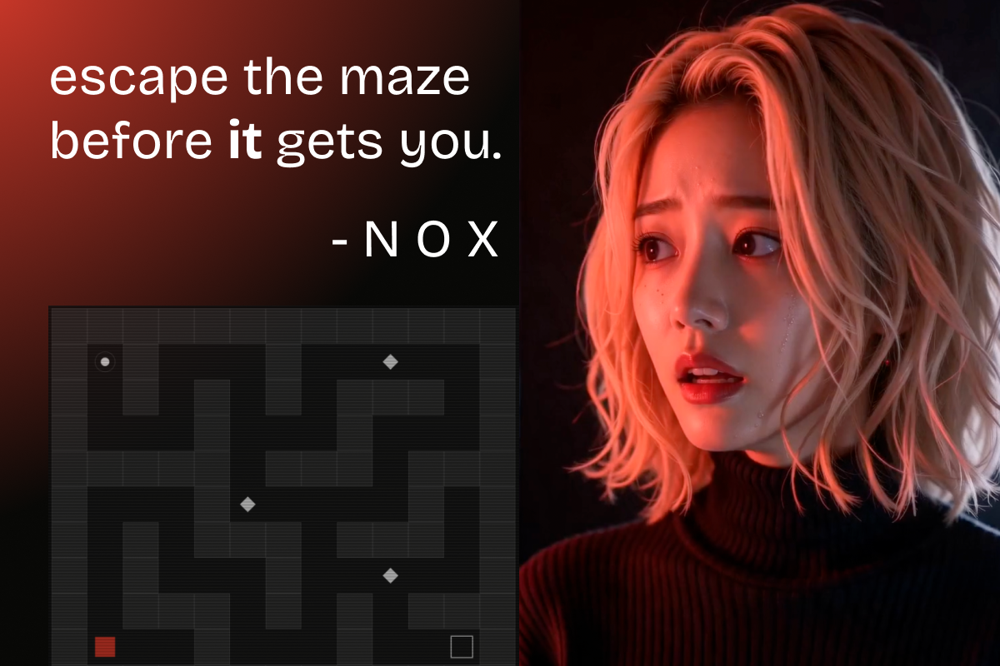

# NOX

*the lights went out 4 seconds ago.*

A horror maze game where sound is everything. Collect fuses, find the exit, don't be found.

Built for **ElevenHacks #6** — Zed + ElevenLabs.

## play
→ [noppy-x.itch.io/nox](https://noppy-x.itch.io/nox)

## design
NOX is brutalist by intention. No music. No ambient noise. No visual comfort.
The maze goes dark 4 seconds in — and stays dark.

Sound becomes the only language. Every flicker reveals walls but alerts the creature.
Every step in silence is a choice. The less you see, the more you hear.

## voices
Powered by ElevenLabs TTS — Dante (Growly and Menacing Monster)

- *"I'm here."* — when the creature spawns
- *"I hear you."* — when the hunt begins
- *"Got you."* — when it catches you

Voice lines are cached locally after first generation — zero repeat API calls.

## built in Zed
NOX was developed in Zed — the fast, minimalist editor felt right for a fast, minimalist game. 
The single-file architecture kept everything in one place, and Zed's clean interface matched 
the brutalist aesthetic of the game itself.

## stack
- Vanilla HTML/CSS/JS — single file
- ElevenLabs TTS API
- Developed in Zed

## by
[noppy-x](https://github.com/noppy-x)
